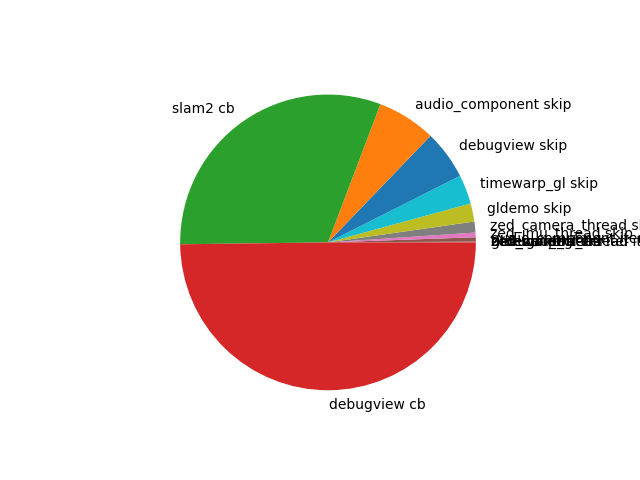
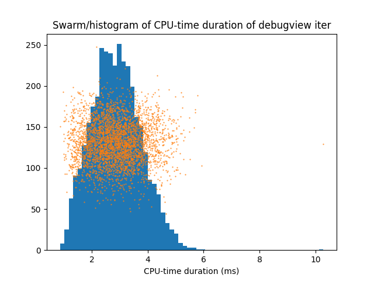
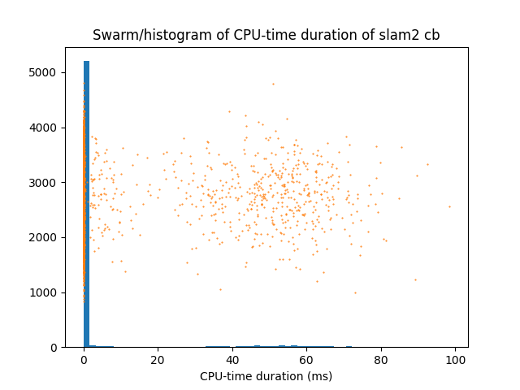
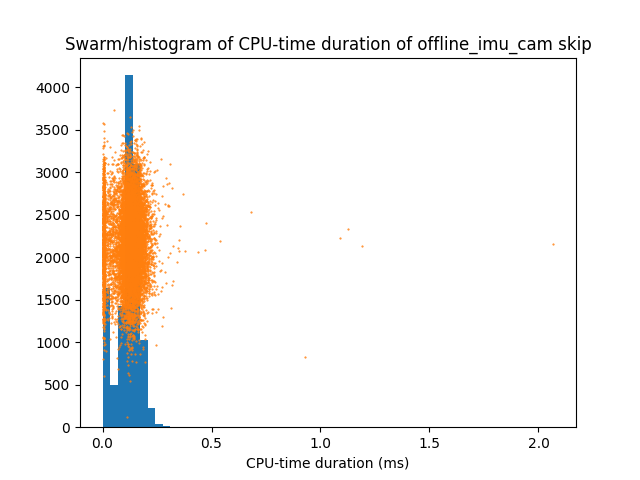
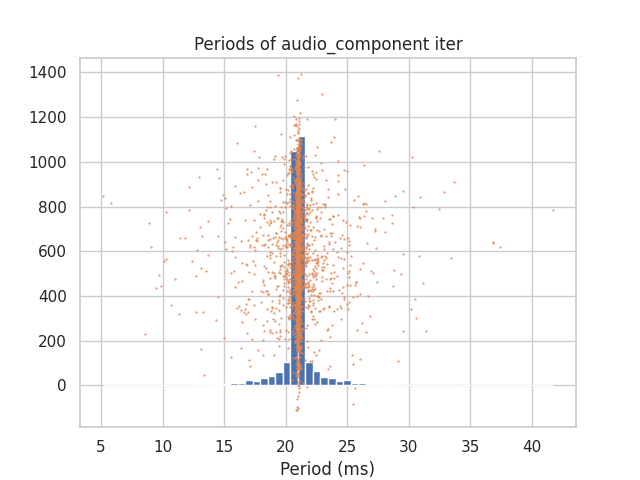
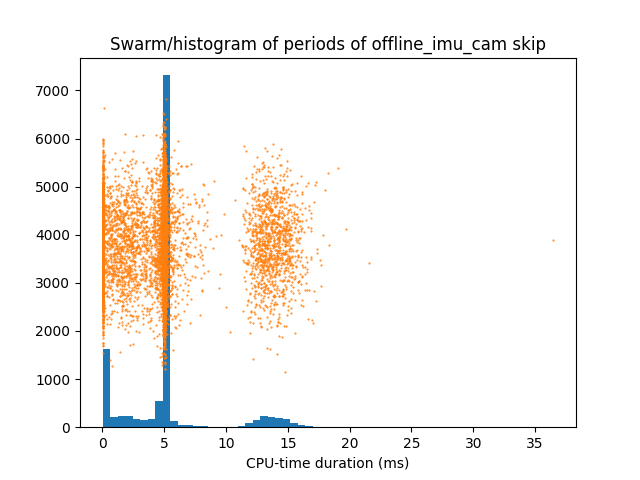

An "account" is a tuple of plugin and activity, where "activity" is either "iteration" (i.e. independent workload), "skip" (i.e. deciding whether or not to run), or "callbacks" (i.e. synchronously dependent workload).

- [`account_summaries.md`](./account_summaries.md) has the "summary statistics" which we can use to verify the data.
  - Look at the `period_mean` (or the `count` if you prefer) to verify the plugin is running at the right frequency.
  - Look at the `cpu_duration_mean` (or `wall_duration_mean` for the special case of GPU plugins and plugins with untracked parallelism) see if the ballpark number is right.

- Pie chart
  - debugview (not present in the real thing) takes up the most time.
  - 

- Timeseries
  - 
  - This isis not as informative as I would like.
  - A huge spike in one timeseries overshadows everything else.
  - Even when I zoom in, the timeseries are too chaotic, and end up hiding each other.

- [`duration_hists/`](./duration_hists/) is nice to see the clean distribution of the durations.
  - The orange points are points whose x-coordinate is a raw data point and y-coordinate is randomly scattered for visual effect.
  - Most are a satisfyingly normal, like debugview-iter below.
  - 
  - However, SLAM and `offline_imu_cam` are horribly bimodal (as we expect because IMU processing vs IMU+image processing)
  - 
  - Most of the skip iterations are extremely fast; they are just checking if it's time to run.
  - 

- [`period_hists/`](./period_hists/) is to check if the components are running at their right period, or if they have outliers.
  - They mostly are, but with a few outliers.
  - Note that the axes are scaled to the min and max, so if the x-axis ends at +70ms, there was a real datapoint out there, and it might be too small to see.
  - Some of the variation in the period could be due to imprecise sleeping. Many of the `_p_should_skip` functions simply sleep and then return.
  - 
  - You often see a bi-modal or tri-modal distribution, often with a space of about 10ms between peaks. This is probably the scheduling quantum.
    - If the component is ready when it gets scheduled, we see a normal distribution around 0.
    - If it has to wait 1 quantum, we see a normal distribution around ~20ms.
    - If it has to wait 2 quantum, we see a normal distribution around ~40ms.
    - et cetera, all summed together (a [Mixed Gaussian](https://en.wikipedia.org/wiki/Mixture_model)--if you will).
    - 
