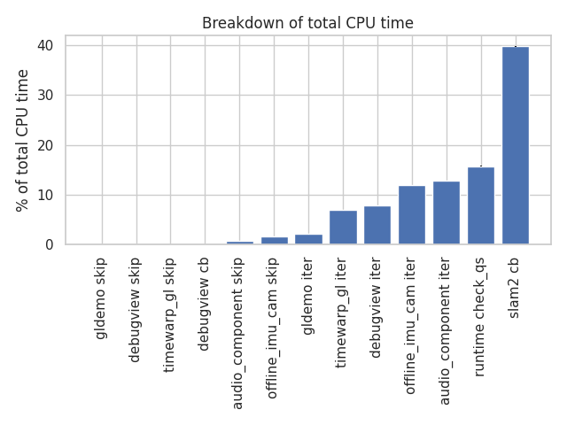
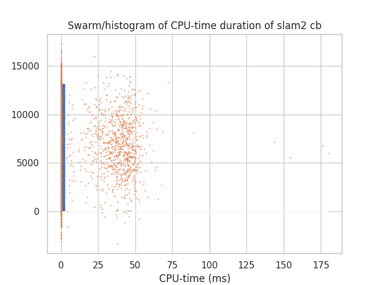
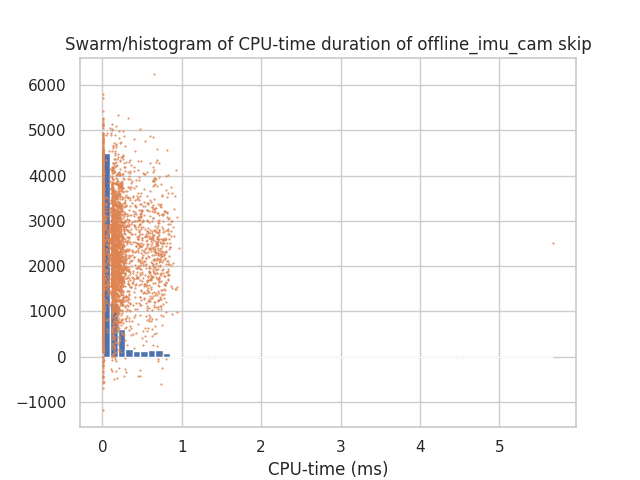

- [`account_summaries.md`](./account_summaries.md) has the "summary statistics" which we can use to verify the data.
  - Look at the `period_mean` (or the `count` if you prefer) to verify the plugin is running at the right frequency.
  - Look at the `cpu_duration_mean` (or `wall_duration_mean` for the special case of GPU plugins and plugins with untracked parallelism) see if the ballpark number is right.

- Bar chart
  - `timewarp_gl iter` is suspiciously large, will investigate next.
  - `runtime check_qs` is pleasatly small.
  - I've changed it fronm a pie chart to a bar chart.
  - 

- Why is timewarp so slow?
  - I have a guess:
```cpp
		// retrieving the recorded elapsed time
		// wait until the query result is available
		while (!done) {
			glGetQueryObjectiv(query, GL_QUERY_RESULT_AVAILABLE, &done);
		}
```
  - This is a tight CPU-spin loop until done. This makes CPU time >= GPU time, because the timewarp thread is "busy" the entire time the GPU is in use.
  - I measured the duration of this loop to confirm my hypothesis [`./timewarp_fence.md`](./timewarp_fence.md).
  - This confirs my gues, because busy-wating on the GPU takes 3.0ms, while the total plugin takes 3.7ms.
  - Next, I'll try with a `std::this_thread::yield()`. This might negatively affect the period however, depending on how long it takes the schduler to swap back.

- Timeseries
  - 
  - This is not as informative as I would like
  - Even when I zoom in, the timeseries are too chaotic, and end up hiding each other.

- [`duration_hists/`](./duration_hists/) is nice to see the clean distribution of the durations.
  - The orange points are points whose x-coordinate is a raw data point and y-coordinate is randomly scattered for visual effect.
  - SLAM and `offline_imu_cam` are horribly bimodal (as we expect because IMU processing vs IMU+image processing)
  - 
  - Ofline IMU/cam skip is weirdly slow.
    -
	```cpp
	virtual skip_option _p_should_skip() override {
		if (_m_sensor_data_it != _m_sensor_data.end()) {
			dataset_now = _m_sensor_data_it->first;
			reliable_sleep(std::chrono::nanoseconds{dataset_now - dataset_first_time} + real_first_time);
			real_now = real_first_time + std::chrono::nanoseconds{dataset_now - dataset_first_time};

			if (_m_sensor_data_it->second.imu0) {
				return skip_option::run;
			} else {
				++_m_sensor_data_it;
				return skip_option::skip_and_yield;
			}

		} else {
			return skip_option::stop;
		}
	}
```
    - The reliable sleep doesn't count much towards the duration, because we measure CPU active time.
    - 
  - Audio pipeline skip is weirily multi-modal.
    - This doesn't make sense to me given the simplicity of the task.
    ```cpp
	virtual skip_option _p_should_skip() override {
		// Could just check time and go back to sleep
		// But actually blocking here is more efficient, because I wake up fewer times,
		// reliable_sleep guarantees responsiveness (to `stop()`) and accuracy
		reliable_sleep(last_iteration += std::chrono::milliseconds{21});
		return skip_option::run;
	}
	```
    - 


- [`period_hists/`](./period_hists/) Idk what's going on here. I'll get back to you on that in the next analysis. Negative values probably indicate an error in the data analysis pipeline.
