- [`account_summaries.md`](./account_summaries.md) has the "summary statistics" which we can use to verify the data.
  - Look at the `period_mean` (or the `count` if you prefer) to verify the plugin is running at the right frequency.
  - Look at the `cpu_duration_mean` (or `wall_duration_mean` for the special case of GPU plugins and plugins with untracked parallelism) see if the ballpark number is right.

- Bar chart
  - `timewarp_gl iter` is *still* suspiciously large.
    - This is despite `yield`ing while waiting on the GPU.
  - `runtime check_qs` is pleasatly small.
  - The error-bars are 1 standard deviation.
  - I've changed it fronm a pie chart to a bar chart.
  - 

- Timeseries
  - 
  - This is not as informative as I would like
  - Even when I zoom in, the timeseries are too chaotic, and end up hiding each other.

- [`cpu_duration_hists/`](./cpu_duration_hists/) is nice to see the clean distribution of the durations.
  - The orange points are points whose x-coordinate is a raw data point and y-coordinate is randomly scattered for visual effect.
  - `slam2` and `offline_imu_cam` are split into case with camera and just IMU data.
  - Ofline IMU/cam skip is weirdly slow.
    - I don't know where the "5ms" mode is coming from.
	- This is the code:

```cpp
	virtual skip_option _p_should_skip() override {
		if (_m_sensor_data_it != _m_sensor_data.end()) {
			dataset_now = _m_sensor_data_it->first;
			reliable_sleep(std::chrono::nanoseconds{dataset_now - dataset_first_time} + real_first_time);
			real_now = real_first_time + std::chrono::nanoseconds{dataset_now - dataset_first_time};

			if (_m_sensor_data_it->second.imu0) {
				return skip_option::run;
			} else {
				++_m_sensor_data_it;
				return skip_option::skip_and_yield;
			}

		} else {
			return skip_option::stop;
		}
	}
```
  - 
    - The reliable sleep doesn't count much towards the duration, because we measure CPU active time.
    - 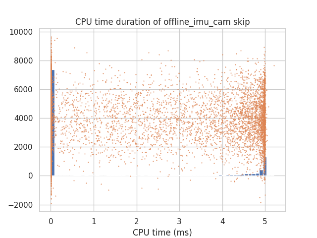

- [`utilization_hists/`](./utilization_hists/) is interesting. It is the CPU time / wall time for an iteration.
  - We can tell off-the-bat that `audio_component iter` is CPU-bound while `gldemo iter` is not, and `offline_imu_cam iter imu` depends.
    - 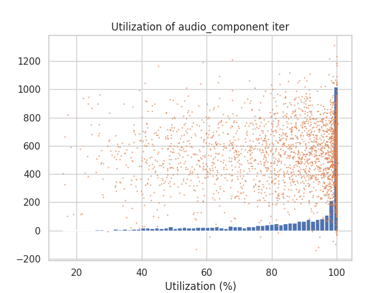
    - 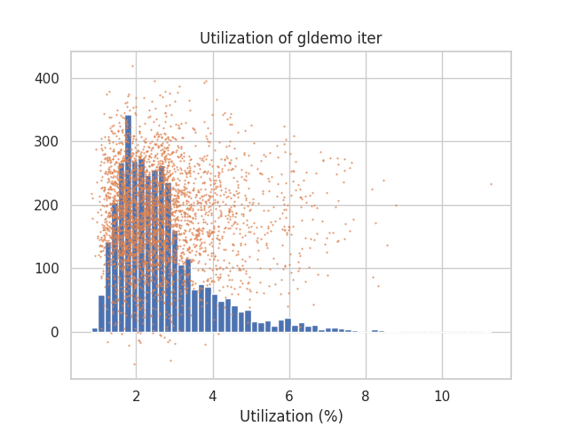
    - 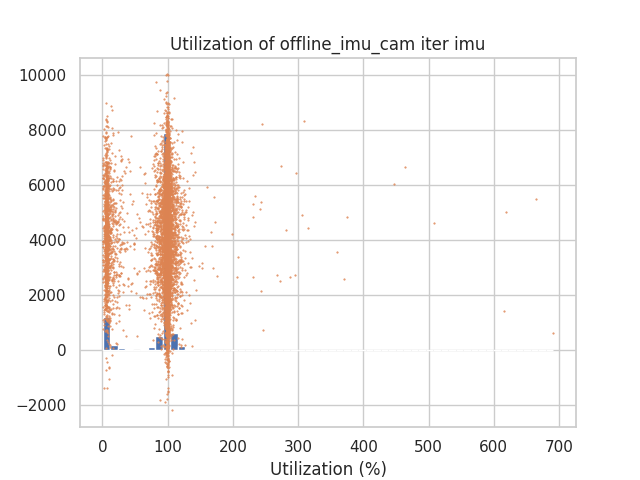
  - I don't know how some iterations have utilization > 100%. It is possible that the CPU timer and wall timer are not at the same granularity, since they are coming from different sources, and this could introduce noise.
    - 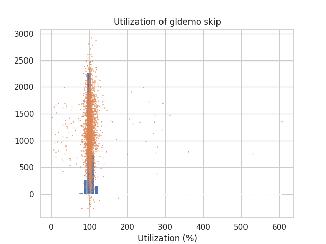

- [`period_hists/`](./period_hists/)
  - Mostly uni-modal bell-shaped.
    - 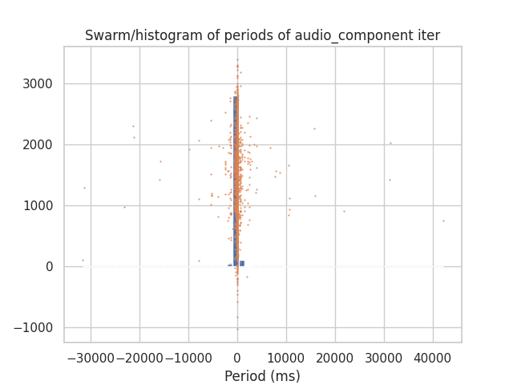
    - 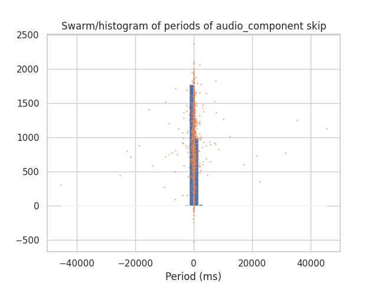
  - However, sometimes a bimodal distribution emerges from whether or not the `should_skip` yields a scheduling quantum.
    - 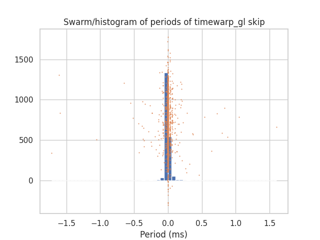
  - SLAM2's callbacks should theoretically be the same as they are in the dataset.
    - The IMU data is mostly good. Either we are behind schedule (period between calls = 0), or we need to wait (period between calls = 50ms)
      - 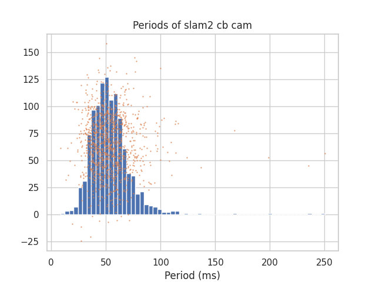
    - I think this callback is always late, so the period is dominated by the duration (no wait time).
    - 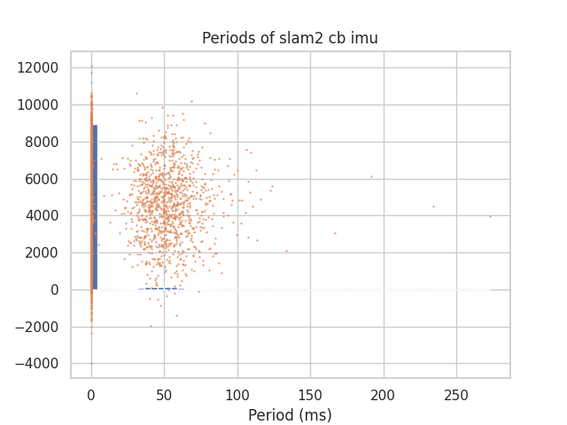
	- For reference, the CPU durations
    - 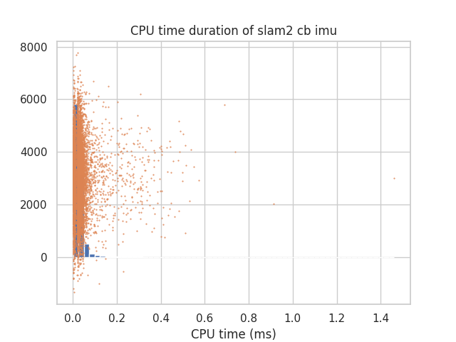

- [`gpu_duration_hists/`](./gpu_duration_hists/) Only one plugin in my experiment used GPU.
  - 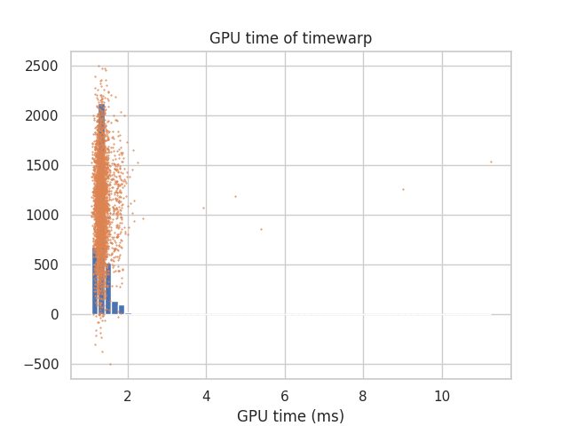
  - It still seems slow (1ms).
  - The outliers are troubling.

- [`gpu_overhead_hists/`](./gpu_overhead_hists/) GPU time / CPU time.
  - 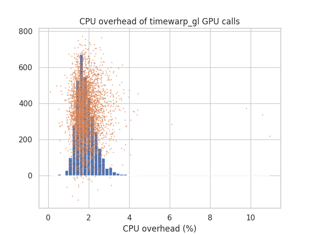
  - Seems good. CPU spends 2% of time telling GPU what to do.
